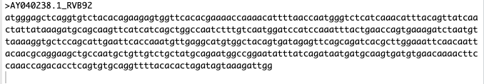
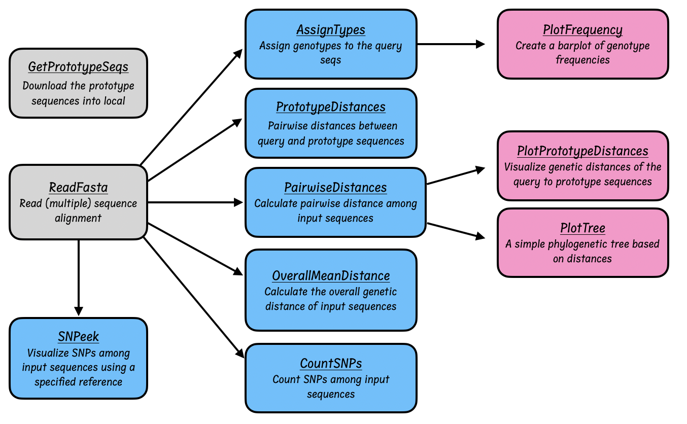

```{r, include = FALSE}
knitr::opts_chunk$set(
  collapse = TRUE,
  comment = "#>",
  fig.path = "man/figures/README-",
  out.width = "100%"
)
```

# rhinotypeR

<!-- badges: start -->
<!-- badges: end -->

```

           /**       /**                       /**                                   /*** *** 
          | **      |**/                      | **                                  | **__  **
  /****** | *******  /** /*******   /******  /******   /**   /**  /******   /****** | **  \ **
 /**__  **| **__  **| **| **__  ** /**__  **|_  **_/  | **  | ** /**__  ** /**__  **| *******/
| **  \__/| **  \ **| **| **  \ **| **  \ **  | **    | **  | **| **  \ **| ********| **__  **
| **      | **  | **| **| **  | **| **  | **  | ** /**| **  | **| **  | **| **_____/| **  \ **
| **      | **  | **| **| **  | **|  ******/  |  *****/|  *******/| ********|  *******/| **  | 
|__/      |__/  |__/|__/|__/  |__/ \______/    \___/   \____  **| **____/  \_______/|__/  |__/
                                                       /**  | **| **                          
                                                      |  ******/| **                          
                                                       \______/ |__/                          

```

## Table of Contents
1. [Background](#Background)
2. [Test-Data](#Test-Data)
3. [Workflow](#Workflow)
4. [Package](#Package)
5. [Contributors](#Contributors/ Citation)

## Background
Rhinoviruses (RV), common respiratory pathogens, are positive-sense, single-stranded RNA viruses characterized by a high antigenic diversity and mutation rate. These viruses are classified into 169 types across three species: RV-A, RV-B, and RV-C. Genotype assignment, a critical aspect of RV research, is based on pairwise genetic distances and phylogenetic clustering with prototype strains, a process currently executed manually and laboriously. We address this by presenting rhinotypeR, an R package that streamlines the classification of rhinoviruses ensuring rapid, reproducible results.


## Test-Data
The project utilizes VP4/2 sequences available in the public domain from
GenBank and reference prototype strains from www.picornaviridae.com
The input datasets (target, reference and prototype) are fasta files.
Here’s an example of a FASTA file: 




## Workflow



RhinotypeR workflow. The user downloads prototype strains using `getPrototypeSeqs()` function, combines these with their newly generated VP4/2 sequences, aligns and manually curates the alignment. 
The user then reads the curated alignment into R using `Biostrings::readDNAStringSet()` function. The DNAStringSet object can then be used to run all the second-level functions, including `assignTypes()` which assigns the sequences into genotypes, filters out the prototype sequences and returns the genotype assignment of the new sequences. This output can be used to visualise the frequency of assigned genotypes.
The distance matrix object, an output of `pairwiseDistance()` function, can be used to create a phylogenetic tree or a heatmap to visualize genetic relatedness of sequences.  


## Package
Our package aims to streamline RV genotype assignment, facilitating genomic scientists in efficiently genotyping RV infections.

### Installation

You can install rhinotypeR from BioConductor using 

``` {r, eval=FALSE}
if (!require("BiocManager", quietly = TRUE))
    install.packages("BiocManager")

BiocManager::install("rhinotypeR")
```

You can also install the development version of rhinotypeR from
GitHub with:


``` {r, eval=FALSE}
devtools::install_github("omicscodeathon/rhinotypeR")
```

##### Load Library

``` {r }
library("rhinotypeR")
```


## Functions
The package encompasses functions to compute genetic distances, perform phylogenetic clustering, and compare sequences against RV prototype strains. 
These functionalities are designed to be user-friendly and adaptable to various research needs.

The package (summarized in Table 1) does the following:
  - Assigns genotypes to query sequences
  - Computes for pairwise distance among query sequences
   - Calculates pairwise distance between query and prototype sequences
  - Calculates overall genetic distance of query sequences
 
#### Table 1. A summary of the functions

| Function        | Role                                   | Input                    | Output                     
|-----------------|----------------------------------------|--------------------------|-----------------------------
| `getPrototypeSeqs()`| Downloads rhinovirus prototype strains into a local directory. These sequences should be combined with and aligned alongside newly generated sequences before being imported into R for genotype assignment | Destination path | RV prototypes are downloaded into the local machine
| `SNPeek()` | Visualizes single nucleotide polymorphisms (SNPs) relative to a specified reference sequence. To specify the reference, move it to the bottom of the alignment. Substitutions are color-coded by nucleotide: A = green, T = red, C = blue, G = yellow | fasta file | A plot highlighting SNPs per sequence
| `plotAA()` |Plots amino acid substitutions with a specified sequence as the reference. The input is an amino acid fasta file (translated DNA sequences). To specify the reference sequence, move it to the bottom of the alignment. Changes are coloured by the class of amino acid: Red = Positively charged, Blue = Negatively charged, Green = Polar, Yellow = Non-polar | Amino acid fasta file | A plot highlighting amino acid substitutions per sequence
| `assignTypes()` | Rapidly assigns genotypes to input sequences. The input fasta file should include the prototype strains, which can be downloaded using getPrototypeSeqs() | fasta file | CSV file with three columns: sequence header, assigned type, and genetic distance  
| `pairwiseDistances()` | Estimates pairwise distances across input sequences using a specified evolutionary model | fasta file | A dense distance matrix
| `overallMeanDistance()` | Estimates the overall mean distance of input sequences  |  fasta file |  A single numeric value
| `countSNPs()` | Counts single nucleotide polymorphisms across input sequences | fasta file | A dense matrix
| `plotFrequency()` | Plots the frequency of assigned genotypes. This function uses the output of assignTypes() as input | output from assignTypes | Barplot
| `plotDistances()` | Visualizes pairwise genetic distances in a heatmap. This function uses the output of pairwiseDistances() as input | distance matrix from prototype distance function | Heatmap
| `plotTree()` | Plots a simple phylogenetic tree using the genetic distances estimated by pairwiseDistances() | output from pairwise distances | A simple phylogenetic tree


## Contributors/ Citation
Martha M. Luka1,#, Ruth Nanjala2, Wafaa M. Rashed3,4,  Winfred Gatua5,6, Olaitan I. Awe7
# m.luka.1@research.gla.ac.uk

Authors’ Affiliation

1. School of Biodiversity, One Health and Veterinary Medicine, University of Glasgow, Glasgow, G12 8QQ, UK.
2. Kennedy Institute of Rheumatology, Nuttfield Department of Orthopaedics, Rheumatology and Musculoskeletal Sciences, University of Oxford, UK.
3. Pharmacy Practice Department, Faculty of Pharmacy, Ahram Canadian University, Egypt.
4. Computational Systems Biology Laboratory, USP, Brazil.
5. MRC Integrative Epidemiology Unit, University of Bristol, UK.       
6. Population Health Sciences, Bristol Medical School, UK.
7. African Society for Bioinformatics and Computational Biology, Cape Town, South Africa.
