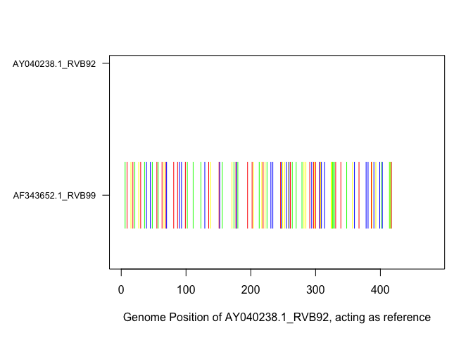
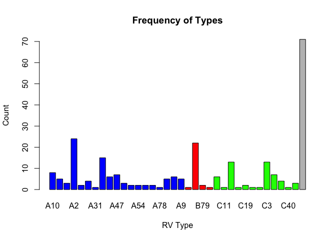
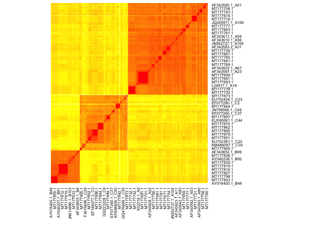
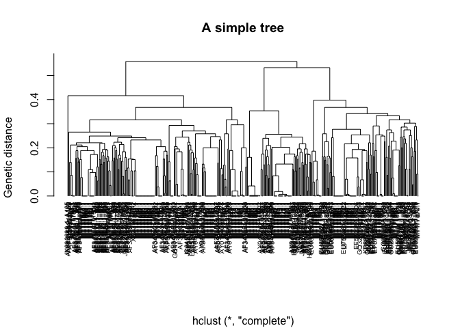
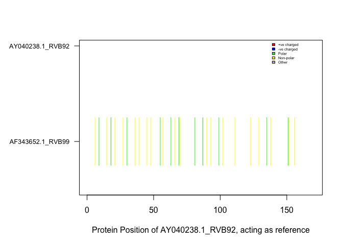

# rhinotypeR


               /**       /**                       /**                                   /*** *** 
              | **      |**/                      | **                                  | **__  **
      /****** | *******  /** /*******   /******  /******   /**   /**  /******   /****** | **  \ **
     /**__  **| **__  **| **| **__  ** /**__  **|_  **_/  | **  | ** /**__  ** /**__  **| *******/
    | **  \__/| **  \ **| **| **  \ **| **  \ **  | **    | **  | **| **  \ **| ********| **__  **
    | **      | **  | **| **| **  | **| **  | **  | ** /**| **  | **| **  | **| **_____/| **  \ **
    | **      | **  | **| **| **  | **|  ******/  |  *****/|  *******/| ********|  *******/| **  | 
    |__/      |__/  |__/|__/|__/  |__/ \______/    \___/   \____  **| **____/  \_______/|__/  |__/
                                                           /**  | **| **                          
                                                          |  ******/| **                          
                                                           \______/ |__/                          

## Table of Contents

1.  [Background](#Background)
2.  [Aim](#Aim)
3.  [Test-Data](#Test-Data)
4.  [Workflow](#Workflow)
5.  [Package](#Package)
6.  [Installation](#Installation)
7.  [Citation](#Citation)
8.  [Contributors](#Contributors)

## Background

Rhinoviruses (RV), common respiratory pathogens, are positive-sense, single-stranded RNA viruses characterized by a high antigenic diversity and mutation rate. With their genome approximately 7.2 kb in length, RVs exhibit mutation rates between 10^-3 and 10^-5 mutations per nucleotide per replication event. These viruses are classified into 169 types across three species: RV-A, RV-B, and RV-C. Genotype assignment, a critical aspect of RV research, is based on pairwise genetic distances and phylogenetic clustering with prototype strains, a process currently executed manually and laboriously.

## Aim
However, while successful, current genotype assignment procedures can be time-consuming, highlighting a pressing need for more efficient alternatives. We provide "rhinotypeR," an R tool that addresses these issues by offering an integrated platform for the quick classification of RV genotypes. By automating the comparison of sequencing data against prototype strains and applying predetermined pairwise distance limits, rhinotypeR intends to make genotype assignment more accessible to researchers. This approach is a big step forward in the drive to improve our epidemiological toolkit, allowing for more effective surveillance and analysis of RVs and possibly other viral diseases with complicated genetic landscapes.

## Test-Data

The project utilizes VP4/2 sequences available in the public domain from GenBank and reference prototype strains from www.picornaviridae.com The input datasets (target, reference and prototype) are fasta files. Here’s an example of a FASTA file:

## Workflow

<figure>

</figure>

Legend: The user downloads prototype strains using `getPrototypeSeqs()` function, combines these with their newly generated VP4/2 sequences, aligns and manually curates the alignment. The user then reads the curated alignment into R using `readFasta()` function. The readFasta object can then be used to run all the second-level
functions, including `assignTypes()` which assigns the sequences into genotypes, filters out the prototype sequences and returns the genotype assignment of the new sequences. This output can be used to visualise the frequency of assigned genotypes. The distance matrix object, an output of `pairwiseDistance()` function, can be used to create a phylogenetic tree or a heatmap to visualize genetic relatedness of sequences.

## Package

Our project aims to develop an R package to automate RV genotype assignment, facilitating genomic scientists in efficiently genotyping RV infections.

Our methodology involves : 
1. Parsing and preprocessing of VP4/2 sequence data.
2. Implementation of algorithms to calculate pairwise genetic distances.
3. Integration of methods for constructing Maximum Likelihood phylogenetic trees.

### Installation

You can install the development version of rhinotypeR from [GitHub](https://github.com) with:

``` r
devtools::install_github("omicscodeathon/rhinotypeR")
```

Load Library

``` r
library("rhinotypeR")
```

### Functions

The package encompasses functions to compute genetic distances, perform phylogenetic clustering, and compare sequences against RV prototype strains. The functionalities, summarized in Table 1, are designed to be user-friendly and adaptable to various research needs. 

#### Table 1. A summary of the functions

|No | Function        | Role            | Input                    | Output                     
|---------------------|-----------------|---------------|--------------|-----------------
| 1. | `getPrototypeSeqs()`| Downloads RV prototypes into a user-specified local directory | Destination path | RV prototypes are downloaded into the local machine
| 2. | `readFasta()` | Read sequences from a FASTA file | fasta file | A fasta file imported into R
| 3. | `SNPeek()` | Visualizing Single Nucleotide Polymorphisms (SNPs) in the fasta file | fasta file | A plot highlighting SNPs per sequence
| 4. | `plotAA()` | Visualise amino acid substitutions using a user-specified sequence as the reference | Amino acid fasta file | A plot highlighting amino acid substitutions per sequence
| 5. | `assignTypes()` | Assigns genotypes to query sequence | fasta file | CSV file with three columns: sequence header, assigned type, and genetic distance  
| 6. | `pairwiseDistances()` | Calculate pairwise distance among input sequences using a user-specified evolutionary model | fasta file | A dense distance matrix
| 7. | `overallMeanDistance()` | Calculates the overall mean genetic distance of query sequences using a user-specified evolutionary model  |  fasta file |  A single numeric value
| 8. | `countSNPs()` | Count pairwise SNPs among query sequences | fasta file | A dense matrix
| 9. | `PlotFrequency()` | Create a barplot of genotype frequencies | output from assignTypes | Barplot
| 10. | `PlotDistances()` | Plots prototype distances | distance matrix from prototype distance function | Heatmap
| 11. | `PlotTree()` | Plot a simple phylogenetic tree based on distances | output from pairwise distances | A simple phylogenetic tree


#### Running the functions

#### Function 1: getPrototypeSeqs

- Create an output directory for the prototype files
- Ensure you create an output directory in your current directory before
  running this function, otherwise it will throw an error saying
  “output” folder is not found.

Example

``` r
getPrototypeSeqs(destinationFolder = "./output")
#> [1] "The reference sequences have been downloaded to ./output"
```

Own data

``` r
# getPrototypeSeqs(destinationFolder = "path to an output folder")
```

#### Function 2: readFasta

- Read sequences from a FASTA file

Example

``` r
   # Load the dataset
  test <- system.file("extdata", "test.fasta", package = "rhinotypeR")
  
  # run command
  readFasta(test, desiredLength = 430)
#> $sequences
#> $sequences[[1]]
#> [1] "ATGGGTGCACAGGTTTCAACTCAGAAAAGCGGTTCTCATGAAAATCAGAACATTCTTACCAACGGCTCAAATCAAACATTCACAGTGATTAATTATTACAAGGATGCAGCCAGTTCATCATCCGCTGGACAATCATTATCAATGGATCCAAGCAAGTTTACTGAACCAGTAAAGGACATCATGTTAAAAGGTGCACCAGCACTTAATTCACCTAATATAGAAGCTTGTGGTTATAGTGATAGAGTGGAACAAATAACATTAGGCAATTCCACAATTACCACTCAAGAAGCAGCAAACACAGTTGTTGCTTATGGAGAATGGCCTTCTTTTCTATCAGACAATGATGCTAGTGATGTTAATAAAACTACCAAACCAGATACTTCAGCTTGTAGATTTTATACTTTAGATAGTAAGTTGTGG----------"
#> 
#> $sequences[[2]]
#> [1] "ATGGGAGCTCAGGTGTCTACACAGAAGAGTGGTTCACACGAAAACCAAAACATTTTAACCAATGGGTCTCATCAAACATTTACAGTTATCAACTATTATAAAGATGCAGCAAGTTCATCATCAGCTGGCCAATCTTTGTCAATGGATCCATCCAAATTTACTGAACCAGTGAAAGATCTAATGTTAAAAGGTGCTCCAGCATTGAATTCACCAAATGTTGAGGCATGTGGCTACAGTGATAGAGTTCAGCAGATCACGCTTGGAAATTCAACAATTACAACGCAGGAAGCTGCCAATGCTGTTGTCTGCTATGCAGAATGGCCGGAATATTTATCAGATAATGATGCAAGTGATGTGAACAAAACTTCCAAACCAGACACCTCAGTGTGCAGGTTTTACACACTAGATAGTAAAGATTGG----------"
#> 
#> 
#> $headers
#> [1] "AF343652.1_RVB99" "AY040238.1_RVB92"
```

Own data

``` r
# readFasta("path to fastaFile", desiredLength = 430)
```

#### Function 3: SNPeek

- Visualizing Single Nucleotide Polymorphisms (SNPs) in the fasta file

Example

``` r
  # Load the dataset
  test <- system.file("extdata", "test.fasta", package = "rhinotypeR")
  #read input
  fastaData <- readFasta(fastaFile = test, desiredLength = 480)
  # run command
  SNPeek(fastaData, showLegend = F)
```



Own data

``` r
  # fastaData <- readFasta(fastaFile = "path to fasta file", desiredLength = 480)
  # SNPeek(fastaData, showLegend = F)
```

#### Function 4: assignTypes - Assign genotypes to the query sequence

- The model could be either p-distance, JC, Kimura2p, Tamura3p based on
  your preference.
- The threshhold can also be changed based on your needs.

Example

``` r
  # Load the dataset
  test <- system.file("extdata", "input_aln.fasta", package = "rhinotypeR")
  #read input
  fastaD <- readFasta(test)
  # run command
  head(assignTypes(fastaD, "p-distance"))
#>        query assigned_type distance
#> 1 MT177794.1    unassigned       NA
#> 2 MT177795.1    unassigned       NA
#> 3 MT177796.1    unassigned       NA
#> 4 MT177799.1    unassigned       NA
#> 5 MT177800.1    unassigned       NA
#> 6 MT177801.1    unassigned       NA
```

Own data

``` r
  # fastaD <- readFasta("path to fasta file")
  # assignTypes(fastaD, "p-distance")
```

#### Function 5: pairwiseDistances

- Calculate pairwise distance among input sequences

Example

``` r
# Load the dataset
  test <- system.file("extdata", "input_aln.fasta", package = "rhinotypeR")
  
  # Example usage
  fastaD <- readFasta(test)
  
  #head(pairwiseDistances(fastaD, "p-distance", pairwiseDeletion = FALSE))
  #head(pairwiseDistances(fastaD, "JC", pairwiseDeletion = FALSE))
  #head(pairwiseDistances(fastaD, "Kimura2p", pairwiseDeletion = FALSE))
  #head(pairwiseDistances(fastaD, "Tamura3p", pairwiseDeletion = FALSE))
```

Own data

``` r
# fastaD <- readFasta("path to fasta file")
# pairwiseDistances(fastaD, model = "p-distance", pairwiseDeletion = FALSE)
```

#### Function 6: overallMeanDistance

- Calculates the overall genetic distance of query sequences

Example

``` r
  # Load the dataset
  test <- system.file("extdata", "input_aln.fasta", package = "rhinotypeR")
  
  # usage
  fastaData <- readFasta(test)
  
  overallMeanDistance(fastaData, model="p-distance")
#> [1] 0.3220081
  overallMeanDistance(fastaData, model="JC")
#> [1] 0.4370453
  overallMeanDistance(fastaData, model="Kimura2p")
#> [1] 0.4383451
  overallMeanDistance(fastaData, model="Tamura3p")
#> [1] 0.4517178
```

Own data

``` r
# fastaD <- readFasta("path to fasta file")
# overallMeanDistance(fastaD,  model="p-distance")
```

#### Function 7: countSNPs

- Count SNPs among input sequences

Example

``` r
  # Load the dataset
  test <- system.file("extdata", "test.fasta", package = "rhinotypeR")
  
  # run
  fastaData <- readFasta(test)
  countSNPs(fastaData)
#>                  AF343652.1_RVB99 AY040238.1_RVB92
#> AF343652.1_RVB99                0               93
#> AY040238.1_RVB92               93                0
```

Own data

``` r
# fastaD <- readFasta("path to fasta file")
# countSNPs(fastaD) 
```

#### Function 8: plotFrequency

- Create a barplot of genotype frequencies

Example

``` r
  # Load the dataset
  test <- system.file("extdata", "input_aln.fasta", package = "rhinotypeR")
  
  # Run 
  queryFastaData <- readFasta(test)
  df <- assignTypes(queryFastaData, "p-distance")
  
  plotFrequency(df)
```



``` r
  
  # Color legend
  # "A" = "blue", "B" = "red", "C" = "green", "Other" = "grey"
```

Own data

``` r
  #queryFastaData <- readFasta("path to fasta file")
  #df <- assignTypes(queryFastaData, "p-distance")
  #plotFrequency(df)
```

#### Function 9: plotDistances

- Visualize genetic distances of the query to prototype sequences
- The output of the generate pairwise distance between query and
  prototype sequences (function 4) is the input data.

Example

``` r
  # Load the dataset
  test <- system.file("extdata", "input_aln.fasta", package = "rhinotypeR")
  
  # Example usage
  fastaD <- readFasta(test)
  distancesToPrototypes <- pairwiseDistances(fastaD, "p-distance")
  plotDistances(distancesToPrototypes)
```



Own data

``` r
  #fastaD <- readFasta("path to fasta file")
  #distancesToPrototypes <- pairwiseDistances(fastaD, "p-distance")
  #plotDistances(distancesToPrototypes)
```

#### Function 10: plotTree

- Plot a simple phylogenetic tree based on distances

Example

``` r
  # Load the dataset
  test <- system.file("extdata", "input_aln.fasta", package = "rhinotypeR")
  
  # Example usage
  fastaD <- readFasta(test)
  pdistances <- pairwiseDistances(fastaD, "p-distance")
  plotTree(pdistances)
```



Own data

``` r
 #fastaD <- readFasta("path to fasta file")
 #pdistances <- pairwiseDistances(fastaD, "p-distance")
 #plotTree(pdistances)
```

#### Function 11: plotAA

- Plot a simple phylogenetic tree based on distances

Example

``` r
  # Load the dataset
  test <- system.file("extdata", "test.fasta", package = "rhinotypeR")
  
  # usage
  fastaData <- readFasta(fastaFile = test, desiredLength = 170)
  plotAA(fastaData, showLegend = T)
```



``` r
  
  # Legend
   # R = "red", H = "red", K = "red",      # Positively charged amino acid 
   # D = "blue", E = "blue",               # Negatively charged amino acid 
   # S = "green", T = "green", N = "green", Q = "green", # Polar amino acid 
   # A = "yellow", V = "yellow", I = "yellow", L = "yellow", M = "yellow", F = "yellow", 
   # W = "yellow", P = "yellow", G = "yellow", Y = "yellow", C = "yellow"  # Nonpolar amino acid 
```

Own data

``` r
  #fastaD <- readFasta("path to fasta file", desiredLength = 170)
  #plotAA(fastaData, showLegend = T)
```

## Citation

## Contributors
- Ruth Nanjala
- Martha M. Luka
- Wafaa M. Rashed
- Winfred Gatua
